name: inverse
layout: true
class: center, middle, inverse

---

name: impact
layout: true
class: center, middle, impact, content

---

name: title
layout: true
class: title center

---

name: content
layout: true

---

template: title
name: main-title

# Software Livre

## O que é o Software Livre e porque me devo importar?

---

# Sobre mim

.left-column[

## Tiago Carreira

.tiny[
- DevOps Engineer no trabalho
- Hacking para aprender
- Corrida para o corpo
- Marido/Pai para a vida
]
.tiny[
- Lisboa - Portugal 🇵🇹
- Mestrado em Eng. Eletrotécnica e de Computadores - IST
- Presidente @ ANSOL.org - Ass. Nacional para o Software Livre
- .tiny[ **keywords:** FLOSS, Engenharia, DevOps, Automação, Comunidade, Música, Golang, Cerveja]
]
 
 
]

.rigth-column[
.center[
.pic-circle[

]

]
.center.no-bullets.tiny[

- **web:** https://tiago.carreira.pw
- **telegram:** https://t.me/tcarreira
- **github:** https://github.com/tcarreira
- **mastodon:** https://floss.social/tcarreira
- **linkedIn:** https://linkedin.com/in/tcarreira
]

]

.center[
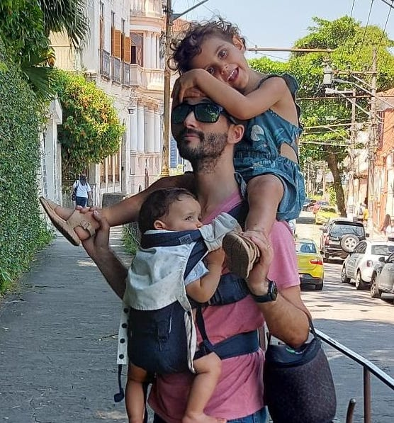

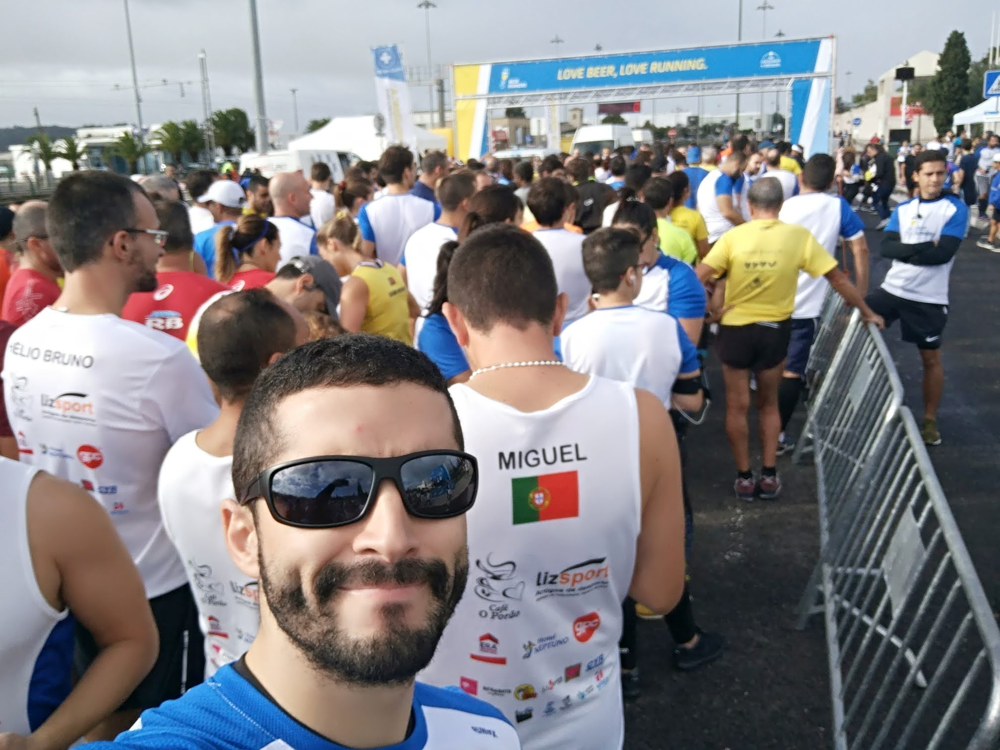

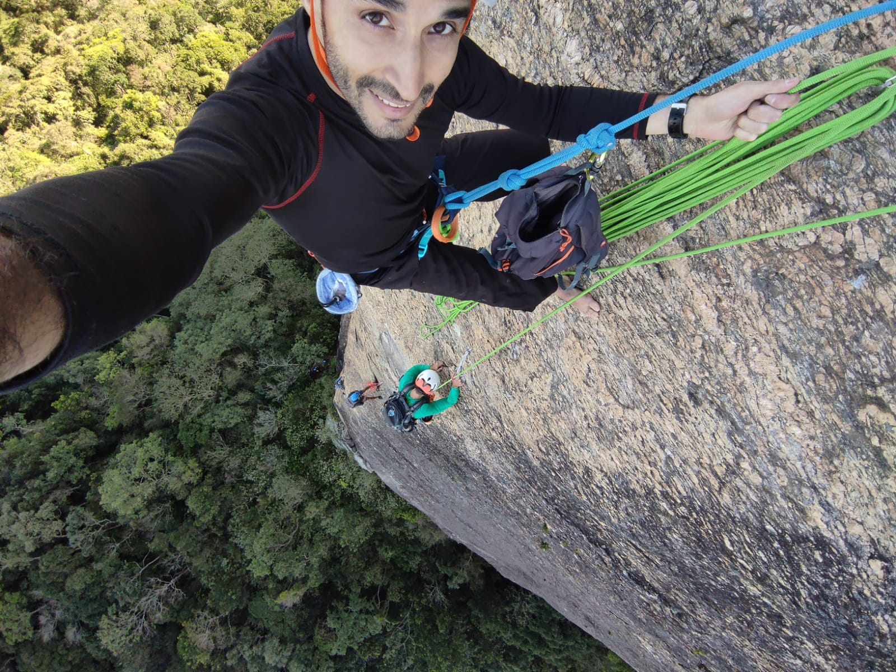

]

---

# Alguns projetos de Software Livre

.left-column[
- Linux
- Eduroam
- FenixEdu
- Git
- Kubernetes
- Nextcloud
- Mozilla Firefox
- LibreOffice
- Apache HTTP Server
- MySQL
- GitLab
]
.right-column[
- VLC Media Player
- Blender
- GIMP
- Moodle
- Blender
- Mastodon
- Jitsi
- Prometheus
- Home Assistant
- Remark-js
- ...
]

???

- Many more.
- a round of applause to Drupal

---

# O que é o Software Livre

- O Movimento do Software Livre
  - Criado em 1983, por Richard Stallman
  - Free Software Foundation fundada em 1985 (fsf.org)
  - Free Software Foundation Europe fundada em 2001 (fsfe.org)

--
 
 
- ANSOL - Associação Nacional para o Software Livre
  - Anunciada oficialmente em Outubro de 2001
  - Associação portuguesa sem fins lucrativos
  - Divulgação, promoção, desenvolvimento, investigação e estudo da Informática Livre...
  - ...e das suas repercussões sociais, políticas, filosóficas, culturais, técnicas e científicas
  - Sediada na Casa das Associações no Porto, mas de âmbito nacional

---

# FLOSS - Free/Libre Open Source Software

> *"free" as in "free speech", not as in "free beer".*

## As 4 liberdades do Software Livre

A liberdade de:

1. **executar** o software, para qualquer uso, em qualquer contexto
1. **estudar** o código e funcionamento de um programa, sem restrições
1. **redistribuir** e partilhar cópias
1. **melhorar** o programa e tornar as modificações públicas

???

No inicio dos anos 80, Richard M. Stallman foi o primeiro a formalizar uma maneira de pensar no software sobre a forma de quatro liberdades

O software que siga esses quatro princípios é chamado "Software Livre" (ou Free Software).

---

# O Poder do Software Livre

- **Liberdade**: Controlar o nosso software, dados e futuro digital
- **Soberania dos Dados**: Ter posse e controlo sob os dados, não o cedendo às grandes empresas de tecnologia
- **Transparência**: Código aberto significa confiança e segurança
- **IA Ética**: Modelos abertos promovem transparência e ajudam a prevenir sistemas enviesados
- **Inovação**: Progresso mais rápido através da partilha de conhecimento
- **Impacto**: Desde projetos pessoais até soluções empresariais
- **Colaboração**: Comunidades globais trabalhando juntas
- **Custo**: Sem pesadas licenças pagas a gigantes tecnológicas

---

# Mas o Software Livre está em Perigo &#9888;

- **Controle Corporativo**: Empresas focadas apenas no lucro a curto prazo
- **Desafios de Sustentabilidade**: Escassez de financiamento e recursos
- **Fragmentação**: Falta de direção unificada em alguns projetos
- **Falta de Governança**: Processos de tomada de decisão inconsistentes
- **Esgotamento de Contribuidores**: Voluntários sobrecarregados e subapoiados
- **Abandono**: Projetos críticos negligenciados ou descontinuados

---

template: inverse

# O Software Livre ainda tem importância?

???

- If people are burned by FLOSS, why does it matter to save it?
- Why is it important?

---

# O Software Livre ainda tem importância!

- **Capacitando Indivíduos**: Software Livre empodera indivíduos, não apenas a tecnologia
- **Comunidade e Colaboração**: Potencia um sentimento de pertença, conectando pessoas
- **Autodeterminação**: Permite que as comunidades moldem seu próprio futuro digital, de forma livre
- **Crescimento Pessoal**: O ato de contribuir ajuda a construir habilidades concretas e fomenta a aprendizagem
- **Retribuição**: É uma oportunidade de contribuir para algo maior
- **Fomentando Inovação através das Pessoas**: Tecnologia não pode substituir a empatia humana
- **Responsabilidade Coletiva**: Software Livre garante que todos tenham uma voz na moldagem do futuro

---

.left-column[

# O que há para MIM?

- Desenvolvimento de habilidades
- Rede de contatos
- Reputação
- Oportunidades de carreira
- Satisfação pessoal
- Aprender com especialistas
- Reconhecimento
- Orientação
]

???

- **Skill Development**: Gain hands-on experience with real-world projects and cutting-edge tech
- **Networking**: Build connections with like-minded professionals and communities worldwide
- **Reputation**: Contribute to projects that showcase your expertise and enhance your portfolio
- **Career Opportunities**: Free Software involvement can lead to job offers, collaborations, and career growth
- **Personal Satisfaction**: Take pride in knowing your work has a positive impact on the world
- **Learning from Experts**: Collaborate with top developers and learn from their experience
- **Recognition**: Get credit for your contributions in a globally recognized space
- **Mentorship**: Both giving and receiving mentorship in a supportive environment

--

.right-column[
# O que há para NÓS?

- Partilha de conhecimento
- Redução de custos
- Inovação mais rápida
- Mais segurança
- Inclusão das comunidades
- Personalização
- Sustentabilidade

]

???

- **Shared Knowledge**: The Drupal community thrives on collective learning, with contributors improving core features and creating modules that benefit everyone
- **Lower Costs**: Organizations can avoid expensive proprietary licenses, focusing resources on custom development or other areas of growth
- **Faster Innovation**: With global collaboration, new features, improvements, and security patches arrive quickly, keeping Drupal ahead of the curve
- **Better Security**: Free Software projects like Drupal are scrutinized by many experts, leading to more robust and secure systems
- **Inclusive Community**: Drupal's community is diverse, welcoming people from all backgrounds to contribute, ensuring more inclusive, accessible solutions
- **Customization**: Free Software provides the flexibility to tailor Drupal to your needs, whether through custom modules or contributed solutions
- **Sustainability**: Drupal's Free Software model ensures that it can evolve based on community needs, ensuring its long-term sustainability and continued improvement

---

template: inverse
class: title

# Não esperes pela Mudança!
## Sê o Catalizador do Progresso do Software Livre

???

Free Software dependes on us, individuals

---

# O Software Livre depende de Ti

**O que fazer:**
- Acolher os principiantes com paciência e orientação
- Partilhar os valores do Software Livre: colaboração, transparência e liberdade
- Encorajar a contribuição das pessoas, independentemente de seu nível de habilidade
- Promover uma cultura de bondade e inclusividade na comunidade
- Liderar com exemplo e respeito

--

**O que NÃO fazer:**

- Não excluir ninguém — o Software Livre é para todos, independentemente do contexto
- Não focar apenas nos aspectos técnicos — abraçar o impacto cultural e social
- Não cair em fundamentalismos — ser aberto a diferentes abordagens e soluçõesns

---

template: inverse
 
 
 
 
 
## "Não espere por grandes líderes; faça você mesmo, pessoa a pessoa."
Madre Teresa

 
 
 
 

.left.tiny[
<!-- \* Alone means to start acting without waiting for others, not doing it apart from others. -->

]

---

# Envolve-te

## Iniciativas

.left-column[
- [Fim do 10](https://ansol.org/iniciativas/fim-do-10/)
- [Public Money, Public Code](https://ansol.org/iniciativas/public-code/)
- [Diz Não ao DRM](https://ansol.org/iniciativas/diz-nao-ao-drm/)
- [Monitorização do RNID](https://ansol.org/iniciativas/monitorizacao-rnid/)
- [Fedigov: Comunicação federada nas instituições públicas](https://ansol.org/iniciativas/fedigov/)
]
.right-column[
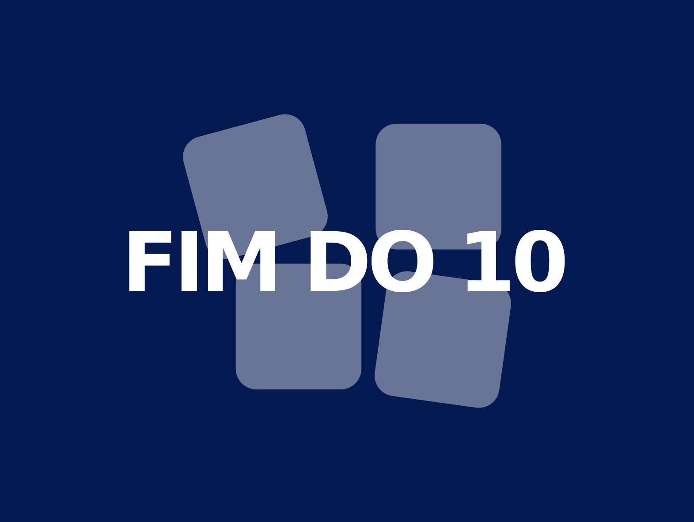
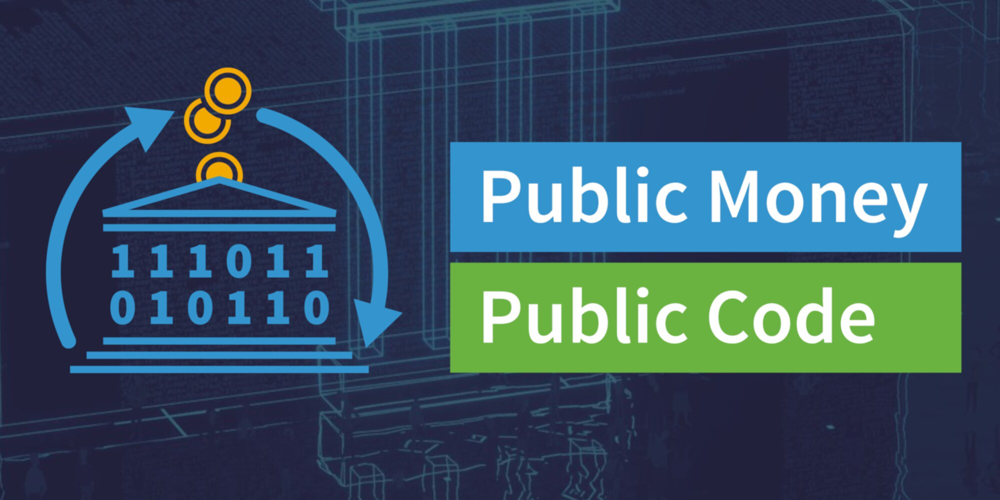
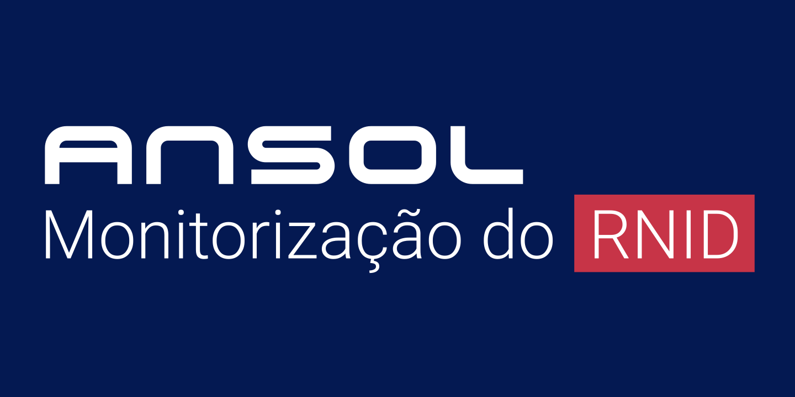

]

---

# Envolve-te

## Projetos

.left-column[
- Festa do Software Livre - 3 a 5 out - FEUP
  - https://festa2025.softwarelivre.eu
- Encontros de Comunidades de Tecnologias Livres
  - https://ectl.pt
- Centro Linux
  - https://centrolinux.pt
- ...
]
.right-column.center[
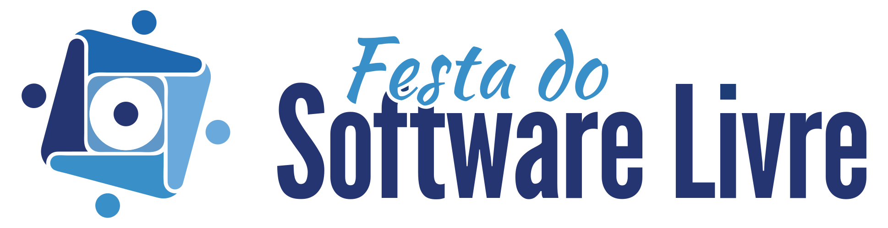
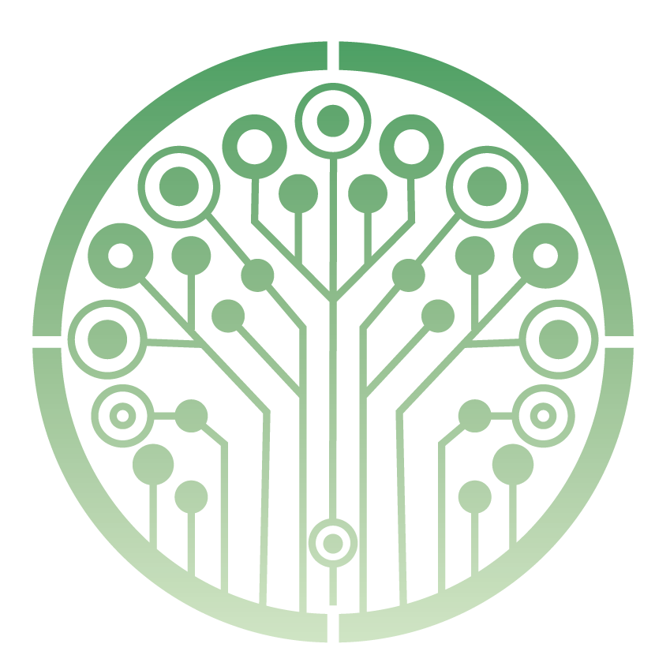
]
---

# Envolve-te

## Comunidades

.left-column[
- ANSOL
- D3 - Defesa dos Direitos Digitais
- Drupal Portugal
- Inércia
- OSGeo - The Open Source Geospatial Foundation
- Ubuntu-PT
- Wikimedia Portugal
- ...
]
.right-column.center[

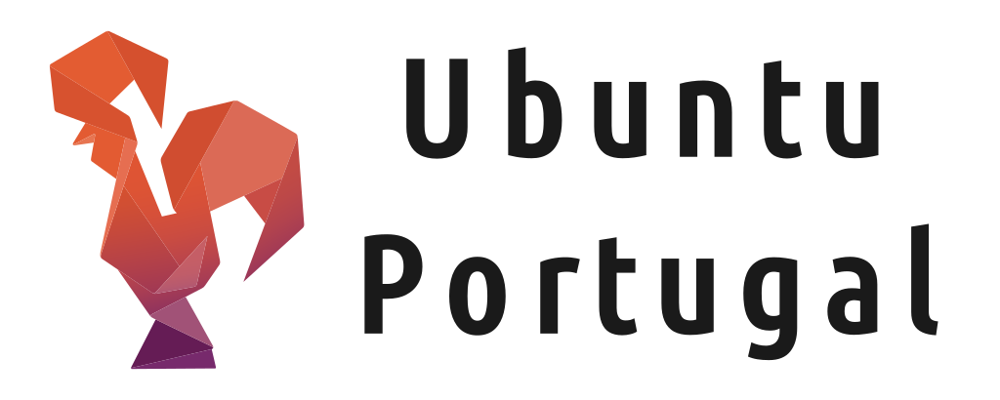

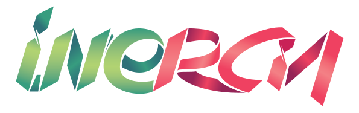

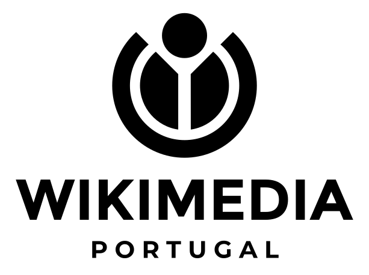
]

---

# Obrigado

.left-column[
Esta apresentação está disponível como Software Livre:
.small[
https://tcarreira.github.io/presentations/freesoftware/
]

- https://ansol.org/inscricao
- https://festa2025.softwarelivre.eu
 
 
 
 
 
 
]

.rigth-column[
.center[
.pic-circle[

]

]
.center.no-bullets.tiny[

- **web:** https://tiago.carreira.pw
- **telegram:** https://t.me/tcarreira
- **github:** https://github.com/tcarreira
- **mastodon:** https://floss.social/tcarreira
- **linkedIn:** https://linkedin.com/in/tcarreira
]

]
