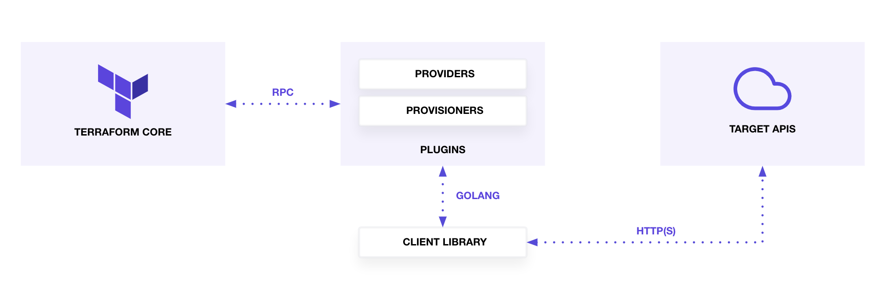
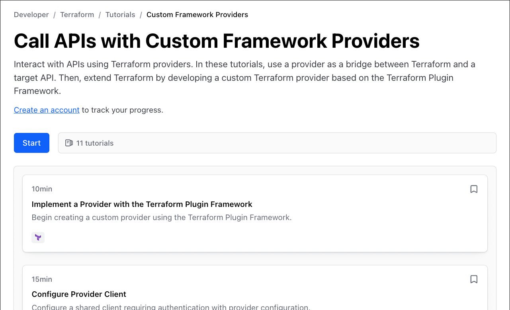

name: inverse
layout: true
class: center, middle, inverse

---

name: impact
layout: true
class: center, middle, impact, content

---

name: title
layout: true
class: title center

---

name: content
layout: true

---

template: title
name: main-title


.content[

# Terraform Providers

.no-bullets[
- Tiago Carreira
]
]

---


# Sobre mim
## Tiago Carreira

.left-column[


- DevOps Engineer @ tsuru.io (Globo)
.small[
- https://  github.com/tsuru
- https://  registry.terraform.io/providers/tsuru
]
- 🇵🇹 &rarr; Rio de Janeiro
.small[
- Engenharia Eletrotécnica e de Computadores
- 10+ anos de experiência com Linux
- linguagens: bash, python, **go**
- editor de texto: vscode, vim
- .tiny[ **keywords:** DevOps, Automação, CI/CD, Docker, Cerveja]
]
]


.rigth-column[
.center.pic-circle[

]

.center.no-bullets.tiny[
- **telegram:** https://t.me/tcarreira
- **github:** https://github.com/tcarreira
- **web:** https://tiago.carreira.pw
]

]

---

layout: false
template: impact
name: agenda

# Agenda

.content.align-left[
- [Terraform](#what-is-terraform)
- [Terraform Provider](#what-is-terraform-provider)
- [Criando um Provider:](#creating-a-provider)

<div class="tiny" style="margin-left: 100px;">
.left-column[
- [Terraform Plugin Framework](#terraform-plugin-framework)
- [Cliente Provider](#provider-client)
- [Data Source](#data-source)
]
.right-column[
- [Resource CRUD](#resource-crud)
- [Resource import](#resource-import)
- [Testes](#testing)
- [Documentação](#documentation)
- [Publicar](#publishing)
]
</div>

]

---

layout: false
template: impact
name: docker-best-practices


---

# Terraform

.left-column[
- Infrastructure as Code
- State as code (ensure state)
- Declarative
- HashiCorp Configuration Language (HCL)
- Write -> Plan -> Apply
- Concepts
  - Data Sources
  - Resources
  - Modules
  - Providers (plugins)

  ]

???

infra, but not only.
Everything with an API can be managed its state by terraform.

- Data Sources: info from outside terraform
- Resources: infrastructure object managed by terraform
- Modules: templates/recipes of terraform code
- Providers:
  - implements resource types
  - speaks with external API
  - terraform &lt;--(provider)--&gt; API

--

.right-column.tiny[
```hcl
terraform {
  required_providers {
    hashicups = {
      source = "hashicorp.com/edu/hashicups-pf"
    }
  }
}

<+>provider "hashicups" {
<+>  host     = "http://localhost:19090"
<+>  username = "admin"
<+>}

<+>data "hashicups_coffees" "edu" {}

<+>resource "hashicups_order" "edu" {
<+>  items = [
<+>    ...
<+>  ]
<+>}

```

]

---

# Terraform Providers (Plugins)

O Terraform depende de plugins chamados *providers* para interagir com provedores de cloud, SaaS e outras APIs.
Os providers definem recources.

.center[

]
.tiny.align-right[
\* image: https://developer.hashicorp.com/terraform/tutorials/providers/provider-use
]

---

template: impact

# Criando um Provider

---

# Criando um Provider

- Extender o Terraform: criando novos resources
- CRUD
  - Create
  - Read
  - Update (opcional)
  - Delete

---

# Criando um Provider

Tutorial:
<span class="tiny">
https://developer.hashicorp.com/terraform/tutorials/providers-plugin-framework
<span>



???

Deprecated: Terraform Plugin SDK

Newest: Terraform Plugin Framework

---

# Criando um Provider

Template:
https://github.com/hashicorp/terraform-provider-scaffolding-framework


---

# Terraform Plugin Framework


---

# Client Provider


---

# Data Source


---

# Resource CRUD


---

# Resource import


---

# Testes


---

# Documentação


---

# Publicar


---


---

template: impact

.content[

# What next

]

---


# References

[1] Call APIs with Custom Framework Providers<br>
https://developer.hashicorp.com/terraform/tutorials/providers-plugin-framework

---

# Watch Later

https://tcarreira.github.io/presentations/hashicorp-meetup-terraform-providers/

.tiny[
https://github.com/tcarreira/presentations/tree/main/hashicorp-meetup-terraform-providers
]


.align-right.tiny[
<br><br><br><br><br><br><br><br><br><br>
**note:**<br>
deprecated tutorial:<br >
https://developer.hashicorp.com/terraform/tutorials/providers
]

---

# Questions/Suggestions?

&nbsp;
.tiny[
&nbsp;
]


.center[
<span style="font-size: 5em;">?</span>
]

.small.align-right.no-bullets.right-column[
- **telegram:** https://t.me/tcarreira
- **github:** https://github.com/tcarreira
- **web:** https://tiago.carreira.pw
]


---

template: title

.content[
<br><br>
# Terraform Providers
]

.content[.align-center[
## Obrigado
]]
