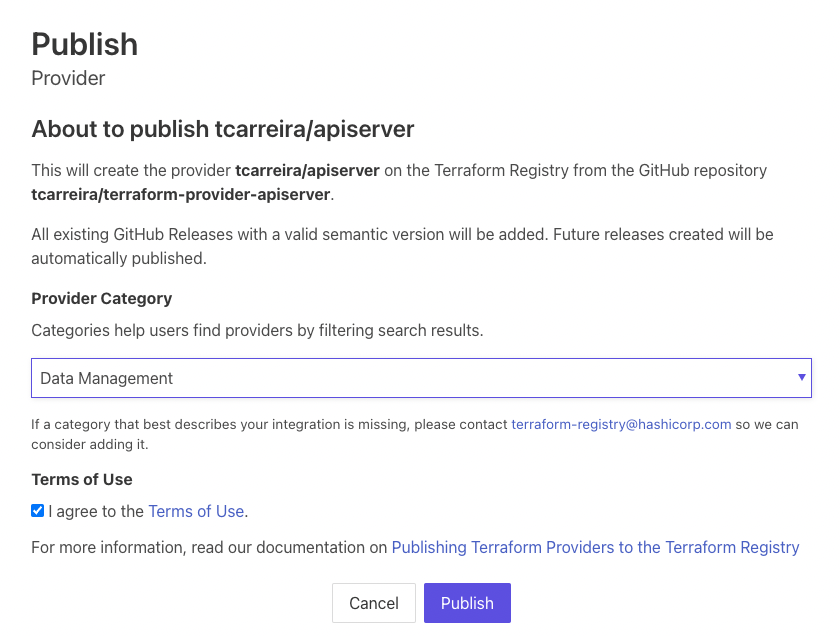

name: inverse
layout: true
class: center, middle, inverse

---

name: impact
layout: true
class: center, middle, impact, content

---

name: title
layout: true
class: title center

---

name: content
layout: true

---

template: title
name: main-title


.content[

# Terraform Providers

.no-bullets[
- Tiago Carreira
]
]

---


# Sobre mim
## Tiago Carreira

.left-column[


- DevOps Engineer @ tsuru.io (Globo)
.small[
- https://  github.com/tsuru
- https://  registry.terraform.io/providers/tsuru
]
- 🇵🇹 → Rio de Janeiro
.small[
- Engenharia Eletrotécnica e de Computadores
- 10+ anos de experiência com Linux
- linguagens: bash, python, **go**
- editor de texto: vscode, vim
- .tiny[ **keywords:** DevOps, Automação, CI/CD, Docker, Cerveja]
]
]


.rigth-column[
.center.pic-circle[

]

.center.no-bullets.tiny[
- **telegram:** https://t.me/tcarreira
- **github:** https://github.com/tcarreira
- **web:** https://tiago.carreira.pw
]

]

---

layout: false
template: impact
name: agenda

# Agenda

.content.align-left[
- [Terraform](#what-is-terraform)
- [Terraform Provider](#what-is-terraform-provider)
- [Criando um Provider:](#creating-a-provider)

<div class="tiny" style="margin-left: 100px;">
.left-column[
- [Terraform Plugin Framework](#terraform-plugin-framework)
- [Cliente Provider](#provider-client)
- [Data Source](#data-source)
]
.right-column[
- [Resource CRUD](#resource-crud)
- [Resource import](#resource-import)
- [Testes](#testing)
- [Documentação](#documentation)
- [Publicação](#publishing)
]
</div>

]

---

layout: false
template: impact
name: docker-best-practices


---

# Terraform

.left-column[
- Infrastructure as Code
- State as code (ensure state)
- Declarative
- HashiCorp Configuration Language (HCL)
- Write -> Plan -> Apply
- Concepts
  - Data Sources
  - Resources
  - Modules
  - Providers (plugins)

  ]

???

infra, but not only.
Everything with an API can be managed its state by terraform.

- Data Sources: info from outside terraform
- Resources: infrastructure object managed by terraform
- Modules: templates/recipes of terraform code
- Providers:
  - implements resource types
  - speaks with external API
  - terraform &lt;--(provider)--&gt; API

--

.right-column.tiny[
```tf
terraform {
  required_providers {
    hashicups = {
      source = "hashicorp.com/edu/hashicups-pf"
    }
  }
}

<+>provider "hashicups" {
<+>  host     = "http://localhost:19090"
<+>  username = "admin"
<+>}

<+>data "hashicups_coffees" "edu" {}

<+>resource "hashicups_order" "edu" {
<+>  items = [
<+>    ...
<+>  ]
<+>}

```

]

---

# Terraform Providers (Plugins)

O Terraform depende de plugins chamados *providers* para interagir com provedores de cloud, SaaS e outras APIs.
Os providers definem recources.

.center[

]
.tiny.align-right[
\* image: https://developer.hashicorp.com/terraform/tutorials/providers/provider-use
]

---

template: impact

# Criando um Provider

---

# Criando um Provider

- Extender o Terraform: criando novos resources
- CRUD
  - Create
  - Read
  - Update (opcional)
  - Delete

---

# Criando um Provider

Tutorial:
<span class="tiny">
https://developer.hashicorp.com/terraform/tutorials/providers-plugin-framework
<span>


???

Deprecated: Terraform Plugin SDK

Newest: Terraform Plugin Framework

---

# Criando um Provider

Template:
https://github.com/hashicorp/terraform-provider-scaffolding-framework

Client:
https://github.com/tcarreira/api-server


---

# Terraform Plugin Framework

.tiny[
```sh
.
├── docs
│   ├── data-sources
│   │   └── example.md
│   ├── index.md
│   └── resources
│       └── example.md
├── examples
│   └── ...
└── internal
    └── provider
        ├── example_data_source.go
        ├── example_data_source_test.go
        ├── example_resource.go
        ├── example_resource_test.go
        ├── provider.go
        └── provider_test.go
```
]

---

template: inverse

# WARNING!

way too many LoC

???

São muitas linhas de código, mas não tenham medo ;)

---

# Terraform Plugin Framework

.tiny[
```golang
// internal/provider/provider.go

<+>var _ provider.Provider = &APIServerProvider{}
type APIServerProvider struct {...}
type APIServerProviderModel struct {
	Endpoint types.String 'tfsdk:"endpoint"'
}
func (p *APIServerProvider) Metadata(ctx context.Context, req provider.MetadataRequest, resp *provider.MetadataResponse) {
	resp.TypeName = "api-server" // Changed from scafolding
	resp.Version = p.version
}
func (p *APIServerProvider) Schema(ctx context.Context, req provider.SchemaRequest, resp *provider.SchemaResponse) {
	resp.Schema = schema.Schema{
		Attributes: map[string]schema.Attribute{
			"endpoint": schema.StringAttribute{
				MarkdownDescription: "Example provider attribute",
				Optional:            true,
			},
		},
	}
}
func (p *APIServerProvider) Configure(ctx context.Context, req provider.ConfigureRequest, resp *provider.ConfigureResponse) {}
func (p *APIServerProvider) Resources(ctx context.Context) []func() resource.Resource {}
func (p *APIServerProvider) DataSources(ctx context.Context) []func() datasource.DataSource {}
func New(version string) func() provider.Provider {}
```
]

---

# Client Provider

.tiny[

```sh
go get "github.com/tcarreira/api-server/pkg/client@v0.1.0"
```

```go
import (... "github.com/tcarreira/api-server/pkg/client" ...)

var _ provider.Provider = &APIServerProvider{}
type APIServerProvider struct {
	version   string
<+>	APIClient client.APIClient
}

func (p *APIServerProvider) Configure(ctx context.Context, req provider.ConfigureRequest, resp *provider.ConfigureResponse) {
	...
	if p.APIClient == nil && !data.Endpoint.IsNull() {
		cli, err := client.NewAPIClient(client.Config{
			Endpoint: data.Endpoint.ValueString(),
		})
		if err != nil {
			resp.Diagnostics.AddError("failed to create api client", err.Error())
			return
		}
		p.APIClient = cli
	}
	resp.DataSourceData = p.APIClient
	resp.ResourceData = p.APIClient
}

```
]

---

template: impact
name: data-source
# Data source

---

# Data Source

.tiny[
```go
// internal/provider/example_data_source.go
var _ datasource.DataSource = &ExampleDataSource{}
func NewExampleDataSource() datasource.DataSource {}
type ExampleDataSourceModel struct {
	ConfigurableAttribute types.String 'tfsdk:"configurable_attribute"'
	Id                    types.String 'tfsdk:"id"'
}
func (d *ExampleDataSource) Metadata(ctx context.Context, req datasource.MetadataRequest, resp *datasource.MetadataResponse) {}
func (d *ExampleDataSource) Schema(ctx context.Context, req datasource.SchemaRequest, resp *datasource.SchemaResponse) {}
func (d *ExampleDataSource) Configure(ctx context.Context, req datasource.ConfigureRequest, resp *datasource.ConfigureResponse) {}
<+>func (d *ExampleDataSource) Read(ctx context.Context, req datasource.ReadRequest, resp *datasource.ReadResponse) {}
```

```go
// internal/provider/provider.go
func (p *APIServerProvider) DataSources(ctx context.Context) []func() datasource.DataSource {
	return []func() datasource.DataSource{
		NewExampleDataSource,
	}
}
```

]

---

# Data Source

.tiny.left-column[
```go
var _ datasource.DataSource = &ExampleDataSource{}
func NewExampleDataSource() datasource.DataSource {}
type ExampleDataSourceModel struct {
	ConfigurableAttribute types.String 'tfsdk:"configurable_attribute"'
	Id                    types.String 'tfsdk:"id"'
}
func (d *ExampleDataSource) Metadata(ctx context.Context, req datasource.MetadataRequest, resp *datasource.MetadataResponse) {}
<+>func (d *ExampleDataSource) Schema(ctx context.Context, req datasource.SchemaRequest, resp *datasource.SchemaResponse) {
<+>	resp.Schema = schema.Schema{
<+>		MarkdownDescription: "Example data source", // documentation
<+>		Attributes: map[string]schema.Attribute{
<+>			"configurable_attribute": schema.StringAttribute{
<+>				MarkdownDescription: "Example configurable attribute",
<+>				Optional:            true,
<+>			},
<+>			"id": schema.StringAttribute{
<+>				MarkdownDescription: "Example identifier",
<+>				Computed:            true,
<+>			},
<+>		},
<+>	}
<+>}
func (d *ExampleDataSource) Configure(ctx context.Context, req datasource.ConfigureRequest, resp *datasource.ConfigureResponse) {}
func (d *ExampleDataSource) Read(ctx context.Context, req datasource.ReadRequest, resp *datasource.ReadResponse) {}
```
]
.right-column.tiny[
```tf
# examples/data-sources/scaffolding_example/data-source.tf

data "scaffolding_example" "example" {
  configurable_attribute = "some-value"
}

output "example" {
  value = scaffolding_example.example
}
```
]

---

# Data Source

.tiny.left-column[
```go
type PersonDataSourceModel struct {
	Id          types.String 'tfsdk:"id"'
	Name        types.String 'tfsdk:"name"'
	Age         types.Int64  'tfsdk:"age"'
	Description types.String 'tfsdk:"description"'
}

func (d *PersonDataSource) Schema(ctx context.Context, req datasource.SchemaRequest, resp *datasource.SchemaResponse) {
	resp.Schema = schema.Schema{
		MarkdownDescription: "Person data source",
		Attributes: map[string]schema.Attribute{
			"id": schema.StringAttribute{
				MarkdownDescription: "Person identifier",
				Required:            true,
			},
			"name": schema.StringAttribute{
				MarkdownDescription: "Person name",
				Computed:            true,
			},
			"age": schema.Int64Attribute{...},
			"description": schema.StringAttribute{...},
		},
	}
}

```
]
.right-column.tiny[
```go
func (d *PersonDataSource) Configure(ctx context.Context, req datasource.ConfigureRequest, resp *datasource.ConfigureResponse) {
	d.client = req.ProviderData.(*client.APIClient)
}

func (d *PersonDataSource) Read(ctx context.Context, req datasource.ReadRequest, resp *datasource.ReadResponse) {
	var data PersonDataSourceModel
	resp.Diagnostics.Append(req.Config.Get(ctx, &data)...)

	id, _ := strconv.Atoi(data.Id.ValueString())
	person, err := d.client.People().Get(id)
	if err != nil {
		resp.Diagnostics.AddError("Error getting person", err.Error())
		return
	}

	data.Name = types.StringValue(person.Name)
	data.Age = types.Int64Value(int64(person.Age))
	data.Description = types.StringValue(person.Description)

	// Save data into Terraform state
	resp.Diagnostics.Append(resp.State.Set(ctx, &data)...)
}
```
]

---

# Data Source

.tiny[
.left-column[
```tf
terraform {
  required_providers {
    apiserver = {
      source = "tcarreira/apiserver"
      version = "0.0.1"
    }
  }
}

provider "apiserver" {
  endpoint = "http://localhost:8888"
}

data "apiserver_person" "example" {
  id = 0
}

output "example" {
  value = data.apiserver_person.example
}
```
]
.right-column[
```sh
❯ terraform apply --auto-approve
Apply complete! Resources: 0 added, 0 changed, 0 destroyed.
Outputs:
example = {
  "age" = 34
  "description" = ""
  "id" = "0"
  "name" = "Tiago"
}
```


```json
{                  `/* terraform.tfstate */`
  "outputs": { "example": { "value": { "age": 34, "description": "", "id": "0", "name": "Tiago"},...},
  "resources": [
    {
      "mode": "data",
      "type": "apiserver_person",
      "name": "example",
      "provider": "provider[\"registry.terraform.io/tcarreira/apiserver\"]",
      "instances": [ { "schema_version": 0,
        "attributes": { "age": 34, "description": "", "id": "0", "name": "Tiago" },
      }]
    }
  ]
}

```
]
]

---

template: impact
name:resource-crud

# Resource CRUD

---

# Resource CRUD

.tiny[
```go
// internal/provider/example_resource.go
var _ resource.Resource = &ExampleResource{} // Ensure provider defined types fully satisfy framework interfaces.
func NewExampleResource() resource.Resource {}
type ExampleResource struct {}
type ExampleResourceModel struct {}

func (r *ExampleResource) Metadata(ctx context.Context, req resource.MetadataRequest, resp *resource.MetadataResponse) {}
func (r *ExampleResource) Schema(ctx context.Context, req resource.SchemaRequest, resp *resource.SchemaResponse) {}
func (r *ExampleResource) Configure(ctx context.Context, req resource.ConfigureRequest, resp *resource.ConfigureResponse) {}

<+>func (r *ExampleResource) Create(ctx context.Context, req resource.CreateRequest, resp *resource.CreateResponse) {}
<+>func (r *ExampleResource) Read(ctx context.Context, req resource.ReadRequest, resp *resource.ReadResponse) {}
<+>func (r *ExampleResource) Update(ctx context.Context, req resource.UpdateRequest, resp *resource.UpdateResponse) {}
<+>func (r *ExampleResource) Delete(ctx context.Context, req resource.DeleteRequest, resp *resource.DeleteResponse) {}

```
```go
// internal/provider/provider.go
func (p *APIServerProvider) Resources(ctx context.Context) []func() resource.Resource {
	return []func() resource.Resource{
		NewExampleResource,
	}
}
```
]

---

## create

.tiny[
```go
func (r *PersonResource) Create(ctx context.Context, req resource.CreateRequest, resp *resource.CreateResponse) {
	var data *PersonResourceModel
<+>	resp.Diagnostics.Append(req.Plan.Get(ctx, &data)...)
	if resp.Diagnostics.HasError() {
		return
	}

	person := &apiTypes.Person{
		Name:        data.Name.ValueString(),
		Age:         int(data.Age.ValueInt64()),
		Description: data.Description.ValueString(),
	}
<+>	err := r.client.People().Create(person)
	if err != nil {
		resp.Diagnostics.AddError("Client Error", fmt.Sprintf("Unable to create person, got error: %s", err))
		return
	}

<+>	data.Id = types.StringValue(strconv.Itoa(person.ID))
<+>	data.LastUpdated = types.StringValue(time.Now().Format(time.RFC3339))

<+>	resp.Diagnostics.Append(resp.State.Set(ctx, &data)...)
}
```
]

???

- read tf data **Plan** from `req`
- call API
- set resource ID
- save State

---

## read

.tiny[
```go
func (r *PersonResource) Read(ctx context.Context, req resource.ReadRequest, resp *resource.ReadResponse) {
	var data *PersonResourceModel
<+>	resp.Diagnostics.Append(req.State.Get(ctx, &data)...)
	if resp.Diagnostics.HasError() {
		return
	}

	id, _ := strconv.Atoi(data.Id.ValueString())
<+>	person, err := r.client.People().Get(id)
	if err != nil {
		resp.Diagnostics.AddError("Error getting person", err.Error())
		return
	}

<+>	data.Name = types.StringValue(person.Name)
<+>	data.Age = types.Int64Value(int64(person.Age))
<+>	data.Description = types.StringValue(person.Description)
<+>	if data.LastUpdated.ValueString() == "" {
<+>		data.LastUpdated = types.StringValue(time.Now().Format(time.RFC3339))
<+>	}

<+>	resp.Diagnostics.Append(resp.State.Set(ctx, &data)...)
}
```
]

???

- read tf data **State** from `req`
- call API
- set resource ID

---

## update

.tiny[
```go
func (r *PersonResource) Update(ctx context.Context, req resource.ReadRequest, resp *resource.ReadResponse) {
	var data *PersonResourceModel
<+>	resp.Diagnostics.Append(req.Plan.Get(ctx, &data)...)
	if resp.Diagnostics.HasError() {
		return
	}

	id, _ := strconv.Atoi(data.Id.ValueString())
	person := &apiTypes.Person{
		Name:        data.Name.ValueString(),
		Age:         int(data.Age.ValueInt64()),
		Description: data.Description.ValueString(),
	}
<+>	err = r.client.People().Update(id, person)
	if err != nil {
		resp.Diagnostics.AddError("Error updating person", err.Error())
		return
	}

<+>	data.Name = types.StringValue(person.Name)
<+>	data.Age = types.Int64Value(int64(person.Age))
<+>	data.Description = types.StringValue(person.Description)
<+>	if data.LastUpdated.ValueString() == "" {
<+>		data.LastUpdated = types.StringValue(time.Now().Format(time.RFC3339))
<+>	}

<+>	resp.Diagnostics.Append(resp.State.Set(ctx, &data)...)
}
```
]

???

- read tf data **Plan** from `req`
- call API
- save state


---

## delete

.tiny[
```go
func (r *PersonResource) Delete(ctx context.Context, req resource.DeleteRequest, resp *resource.DeleteResponse) {
	var data *PersonResourceModel
<+>	resp.Diagnostics.Append(req.State.Get(ctx, &data)...)
	if resp.Diagnostics.HasError() {
		return
	}

	id, err := strconv.Atoi(data.Id.ValueString())
	if err != nil {
		resp.Diagnostics.AddError("Error converting id to int", err.Error())
		return
	}
<+>	err = r.client.People().Delete(id)
	if err != nil {
		resp.Diagnostics.AddError("Error deleting person", err.Error())
		return
	}
<+>	// no error in the end, resource gets deleted from state
}
```
]

???

- read tf data **State** from `req`
- call API
- return no error (if error, does not clean state)

---

template: impact
name: resource-import

# Resource import

---

# Resource import

```go
func (r *PersonResource) ImportState(ctx context.Context, req resource.ImportStateRequest, resp *resource.ImportStateResponse) {
	resource.ImportStatePassthroughID(ctx, path.Root("id"), req, resp)
}
```

- `terraform import <ID>`
- saves the ID to state
- call resource `Read()`
- save full state


---
template: impact
name: testes

# Testes

---

# Testes

- Testes de integração:  `make testacc`
  - Normalmente, gasta recursos ($$$)
  - Alternativa: subir um FakeServer

---

# Testes

.tiny[

```go
func TestAccPersonDataSource(t *testing.T) {
	resource.Test(t, resource.TestCase{
		PreCheck: func() {
			c, _ := client.NewAPIClient(client.Config{Endpoint: "http://localhost:18080"})
			c.People().Create(&apiTypes.Person{Name: "personXXX", Age: 49})
		},
		CheckDestroy: func(s *terraform.State) error {
			c, _ := client.NewAPIClient(client.Config{Endpoint: "http://localhost:18080"})
			c.People().Delete(0)
			return nil
		},
		ProtoV6ProviderFactories: testAccProtoV6ProviderFactories,
		Steps: []resource.TestStep{
			{
				Config: providerConfig + testAccPersonDataSourceConfig,
				Check: resource.ComposeAggregateTestCheckFunc(
					resource.TestCheckResourceAttr("data.apiserver_person.test", "name", "personXXX"),
					resource.TestCheckResourceAttr("data.apiserver_person.test", "age", "49"),
				),
			},
		},
	})
}

```
]

---

# Testes

.tiny.left-column[

```go
func TestAccPersonDataSource(t *testing.T) {
	resource.Test(t, resource.TestCase{
		PreCheck: func() {
			c, _ := client.NewAPIClient(client.Config{Endpoint: "http://localhost:18080"})
			c.People().Create(&apiTypes.Person{Name: "personXXX", Age: 49})
		},
		CheckDestroy: func(s *terraform.State) error {
			c, _ := client.NewAPIClient(client.Config{Endpoint: "http://localhost:18080"})
			c.People().Delete(0)
			return nil
		},
		ProtoV6ProviderFactories: testAccProtoV6ProviderFactories,
		Steps: []resource.TestStep{
			{
<+>				Config: providerConfig + testAccPersonDataSourceConfig,
				Check: resource.ComposeAggregateTestCheckFunc(
					resource.TestCheckResourceAttr("data.apiserver_person.test", "name", "personXXX"),
					resource.TestCheckResourceAttr("data.apiserver_person.test", "age", "49"),
				),
			},
		},
	})
}

```
]
.tiny.right-column[

```go
const providerConfig = `
provider "apiserver" {
	endpoint = "http://localhost:18080"
}
`

const testAccPersonDataSourceConfig = `
data "apiserver_person" "test" {
  id = 0
}
`

```
]

---
template: impact
name: documentation

# Documentação

---

# Documentação

.tiny[
.left-column[
```sh
go generate ./...
```

```go
                 /* `tools/tools.go` */
//go:build tools

package tools

import (
	// Documentation generation
	_ "github.com/hashicorp/terraform-plugin-docs/cmd/tfplugindocs"
)

```

<br><br><br><br><br><br>
https://registry.terraform.io/tools/doc-preview
]
.right-column[
```sh
.
├── docs
│   ├── data-sources
│   │   └── person.md
│   ├── index.md
│   └── resources
│       └── person.md
├── examples
│   ├── README.md
│   ├── data-sources
│   │   └── apiserver_person
│   │       └── data-source.tf
│   ├── provider
│   │   └── provider.tf
│   └── resources
│       └── apiserver_person
│           └── resource.tf
└── tools
    └── tools.go
```
]
]

---

template: impact
name: publishing

# Publicação

---

# Publicação
.left-column[
Pela documentação:
- goreleaser + github-actions
- criar uma nova chave GPG
- adicionar chave privada no GH (GPG_PRIVATE_KEY + PASSPHRSE)
- adicionar chave pública no Terraform
- criar uma tag git + `git push origin <tag>`
- Publicar
]
.right-column[

]

---


---

template: impact

.content[

# What next

]

---


# References

[1] Call APIs with Custom Framework Providers<br>
https://developer.hashicorp.com/terraform/tutorials/providers-plugin-framework

---

# Watch Later

https://tcarreira.github.io/presentations/hashicorp-meetup-terraform-providers/

.tiny[
https://github.com/tcarreira/presentations/tree/main/hashicorp-meetup-terraform-providers
]


.align-right.tiny[
<br><br><br><br><br><br><br><br><br><br>
**note:**<br>
deprecated tutorial:<br >
https://developer.hashicorp.com/terraform/tutorials/providers
]

---

# Questions/Suggestions?

&nbsp;
.tiny[
&nbsp;
]


.center[
<span style="font-size: 5em;">?</span>
]

.small.align-right.no-bullets.right-column[
- **telegram:** https://t.me/tcarreira
- **github:** https://github.com/tcarreira
- **web:** https://tiago.carreira.pw
]


---

template: title

.content[
<br><br>
# Terraform Providers
]

.content[.align-center[
## Obrigado
]]
