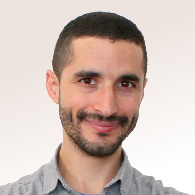
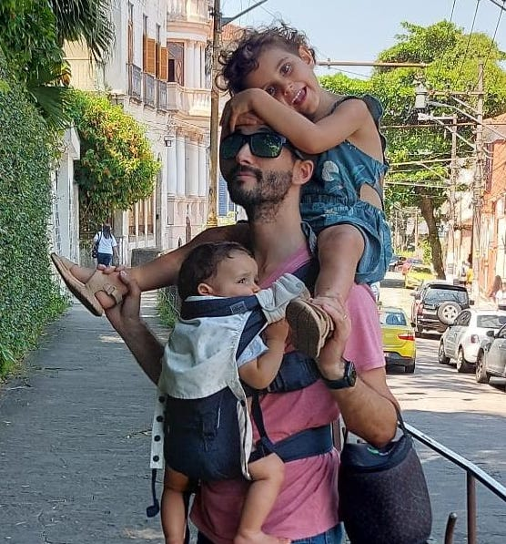
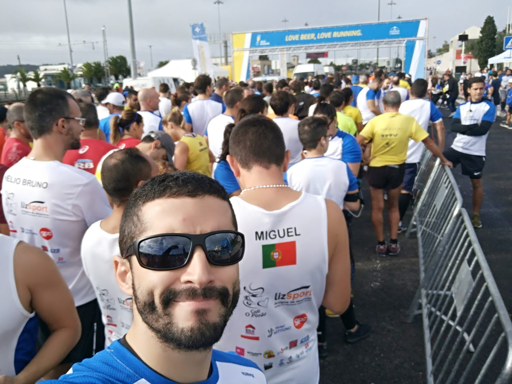
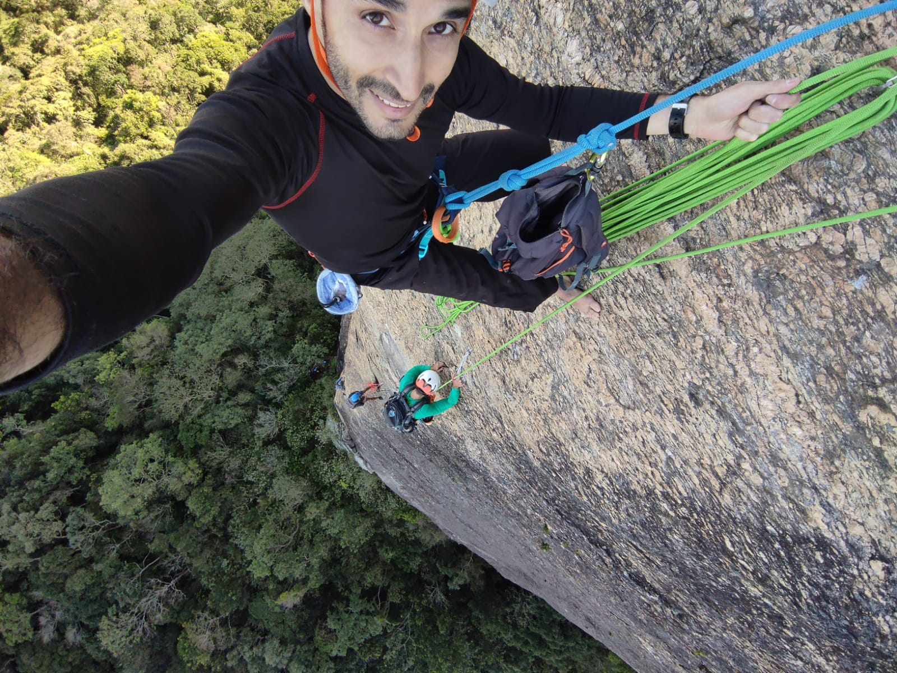

name: inverse
layout: true
class: center, middle, inverse

---

name: impact
layout: true
class: center, middle, impact, content

---

name: title
layout: true
class: title center

---

name: content
layout: true

---

template: title
name: main-title

# Let Open Source set us Free

## A Call to Action for a Better Digital World

---

# About Me

.left-column[

## Tiago Carreira

.tiny[
- DevOps Engineer for work
- Hacking for Learning
- Running for Mind
- Husband/Father for Life.
]
.small[
- Lisbon - Portugal 🇵🇹
- President of ANSOL.org - PT FLOSS Association
- .tiny[ **keywords:** FLOSS, Engineering, DevOps, Automation, Community, Music, Adrenaline, Learning, Helping, Fun, Beer]
]
]

.rigth-column[
.center[
.pic-circle[

]

]
.center.no-bullets.tiny[

- **web:** https://tiago.carreira.pw
- **telegram:** https://t.me/tcarreira
- **github:** https://github.com/tcarreira
- **mastodon:** https://floss.social/tcarreira
- **linkedIn:** https://linkedin.com/in/tcarreira
]

]

.center[

]

---

# Successful Projects  

.left-column[
- Linux
- Drupal
- Kubernetes
- Nextcloud
- Mozilla Firefox
- LibreOffice
- Git
- Apache HTTP Server
- MySQL
- GitLab
- Docker
]
.right-column[
- VLC Media Player
- Blender
- GIMP
- Redis
- OpenStreetMap
- Mastodon
- Jitsi
- Prometheus
- Home Assistant
- Remark-js
- ...
]

???

- Many more.
- a round of applause to Drupal

---

# The Power of Open Source

- **Freedom**: Control your software, data, and digital future
- **Data Sovereignty**: Own and control your data, not big tech
- **Transparency**: Open code means trust and security
- **Ethical AI**: Open models promote transparency and help prevent biased, proprietary systems
- **Innovation**: Faster progress through shared knowledge
- **Impact**: From personal projects to enterprise solutions
- **Collaboration**: Global communities building together

???

### The four essential freedoms
A program is free software if the program's users have the four essential freedoms: [1]

- The freedom to run the program as you wish, for any purpose (freedom 0).
- The freedom to study how the program works, and change it so it does your computing as you wish (freedom 1). Access to the source code is a precondition for this.
- The freedom to redistribute copies so you can help others (freedom 2).
- The freedom to distribute copies of your modified versions to others (freedom 3). By doing this you can give the whole community a chance to benefit from your changes. Access to the source code is a precondition for this.

---

# But Open Source is Getting Broken

- **Corporate Control**: Corporations steering projects for profit
- **Sustainability Challenges**: Funding and resource scarcity
- **Fragmentation**: Lack of unified direction in some projects
- **Lack of Governance**: Inconsistent decision-making processes
- **Contributor Burnout**: Volunteers overwhelmed and under-supported
- **Abandonment**: Key projects being neglected or discontinued

---

template: inverse

# Why Open Source still matters?

???

- If people are burned by FLOSS, why does it matter to save it?
- Why is it important?

---

# Why Open Source still matters?

- **Empowering People**: Open Source empowers individuals, not just technology
- **Community and Collaboration**: It creates a sense of belonging, connecting people
- **Self-Determination**: It lets communities shape their own digital future, free from control
- **Personal Growth**: Contributing helps build meaningful skills and fosters learning
- **Giving Back**: It’s a chance to contribute to something larger than yourself
- **Fostering Innovation through People**: Technology can’t replace human empathy
- **Collective Responsibility**: Open Source ensures everyone has a voice in shaping the future

---

.left-column[

# What's in for ME?

- **Skill Development**
- **Networking**
- **Reputation**
- **Career Opportunities**
- **Personal Satisfaction**
- **Learning from Experts**
- **Recognition**
- **Mentorship**
]

???

- **Skill Development**: Gain hands-on experience with real-world projects and cutting-edge tech
- **Networking**: Build connections with like-minded professionals and communities worldwide
- **Reputation**: Contribute to projects that showcase your expertise and enhance your portfolio
- **Career Opportunities**: Open Source involvement can lead to job offers, collaborations, and career growth
- **Personal Satisfaction**: Take pride in knowing your work has a positive impact on the world
- **Learning from Experts**: Collaborate with top developers and learn from their experience
- **Recognition**: Get credit for your contributions in a globally recognized space
- **Mentorship**: Both giving and receiving mentorship in a supportive environment

--

.right-column[
# What's in for US?

- **Shared Knowledge**
- **Lower Costs**
- **Faster Innovation**
- **Better Security**
- **Inclusive Community**
- **Customization**
- **Sustainability**
]

???

- **Shared Knowledge**: The Drupal community thrives on collective learning, with contributors improving core features and creating modules that benefit everyone
- **Lower Costs**: Organizations can avoid expensive proprietary licenses, focusing resources on custom development or other areas of growth
- **Faster Innovation**: With global collaboration, new features, improvements, and security patches arrive quickly, keeping Drupal ahead of the curve
- **Better Security**: Open Source projects like Drupal are scrutinized by many experts, leading to more robust and secure systems
- **Inclusive Community**: Drupal’s community is diverse, welcoming people from all backgrounds to contribute, ensuring more inclusive, accessible solutions
- **Customization**: Open Source provides the flexibility to tailor Drupal to your needs, whether through custom modules or contributed solutions
- **Sustainability**: Drupal’s Open Source model ensures that it can evolve based on community needs, ensuring its long-term sustainability and continued improvement

---

template: inverse
class: title

# Don’t Wait for Change!
## Be the Catalyst for Open Source Progress

???

Open source dependes on us, individuals

---

# Open Source Depends on You

**What to Do:**
- Welcome newcomers with patience and guidance
- Share the values of Open Source: collaboration, transparency, and freedom
- Encourage people to contribute, no matter their skill level
- Promote a culture of kindness and inclusivity in the community
- Lead by example and respect

--

**What Not to Do:**
- Don’t exclude anyone — Open Source is for all, regardless of background
- Don’t focus only on technical aspects — embrace the cultural and social impact
- Don’t fall into fundamentalism — be open to different approaches and solutions

---

template: inverse
 
 
 
 
 
## "Do not wait for leaders; do it alone\*, person to person."
Mother Teresa

 
 
 
 

.left.tiny[
\* Alone means to start acting without waiting for others, not doing it apart from others.

]

---

# Thank you

.left-column[
This slides are open source:
https://tcarreira.github.io/presentations/opensource/

https://ansol.org
https://festa2025.softwarelivre.eu
 
 
 
 
 
 
]

.rigth-column[
.center[
.pic-circle[

]

]
.center.no-bullets.tiny[

- **web:** https://tiago.carreira.pw
- **telegram:** https://t.me/tcarreira
- **github:** https://github.com/tcarreira
- **mastodon:** https://floss.social/tcarreira
- **linkedIn:** https://linkedin.com/in/tcarreira
]

]
