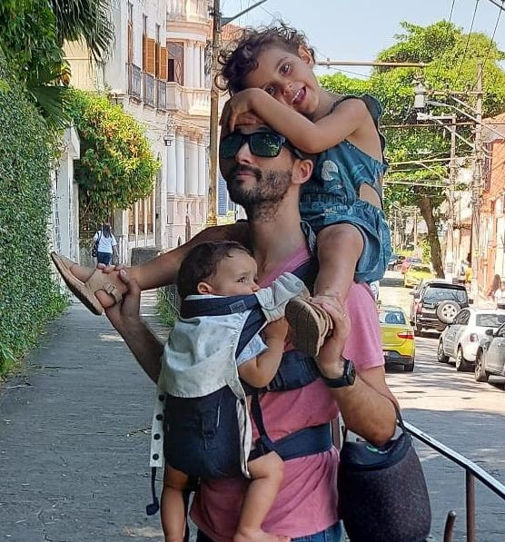
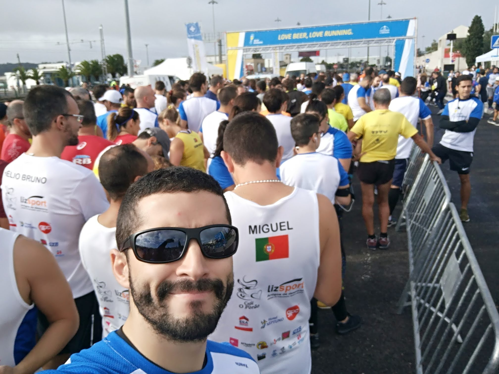
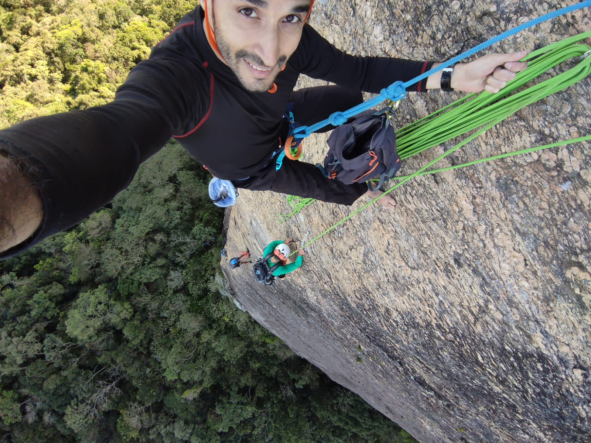

name: inverse
layout: true
class: center, middle, inverse

---

name: impact
layout: true
class: center, middle, impact, content

---

name: title
layout: true
class: title center

---

name: content
layout: true

---

template: title
name: main-title

.content[

# Let Open Source set us Free

## A Call to Action for a Better Digital World

.no-bullets[
- Tiago Carreira
]
]

---

# About Me

.left-column[

## Tiago Carreira

.tiny[
- DevOps Engineer for work
- Hacking for Learning
- Running for Mind
- Husband/Father for Life.
]
.small[
- Lisbon - Portugal 🇵🇹
- President of ANSOL.org - PT FLOSS Association
- .tiny[ **keywords:** FLOSS, Engineering, DevOps, Automation, Community, Music, Adrenaline, Learning, Helping, Fun, Beer]
]
]

.rigth-column[
.center[
.pic-circle[

]

]
.center.no-bullets.tiny[

- **web:** https://tiago.carreira.pw
- **telegram:** https://t.me/tcarreira
- **github:** https://github.com/tcarreira
- **mastodon:** https://floss.social/tcarreira
- **linkedIn:** https://linkedin.com/in/tcarreira
]

]

.center[

]

---
